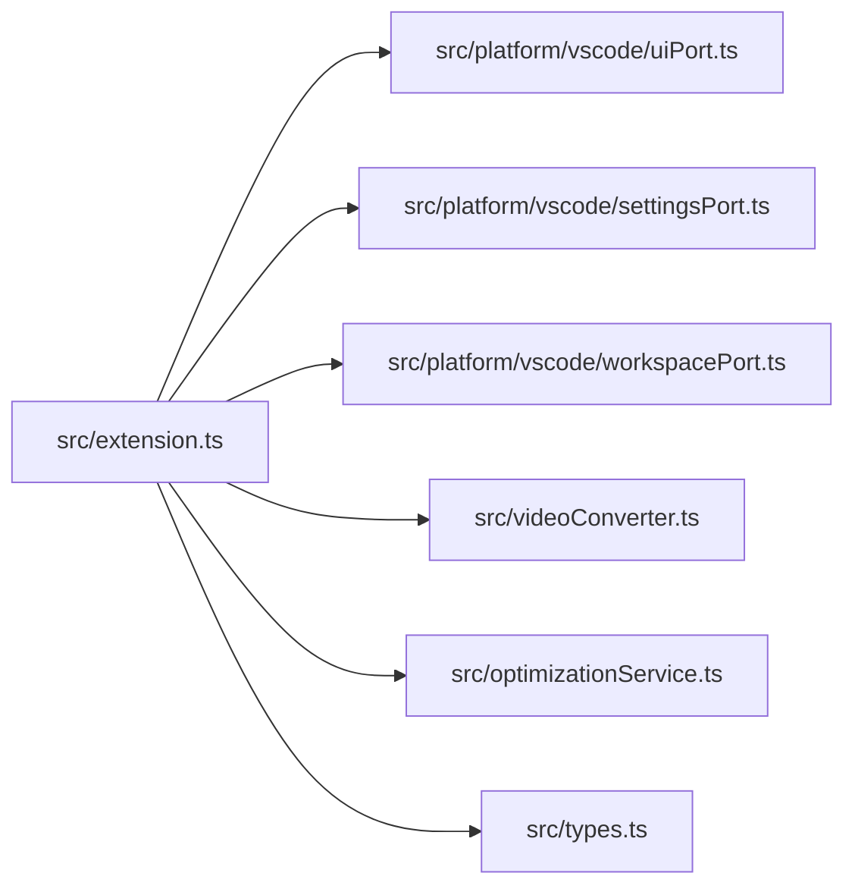
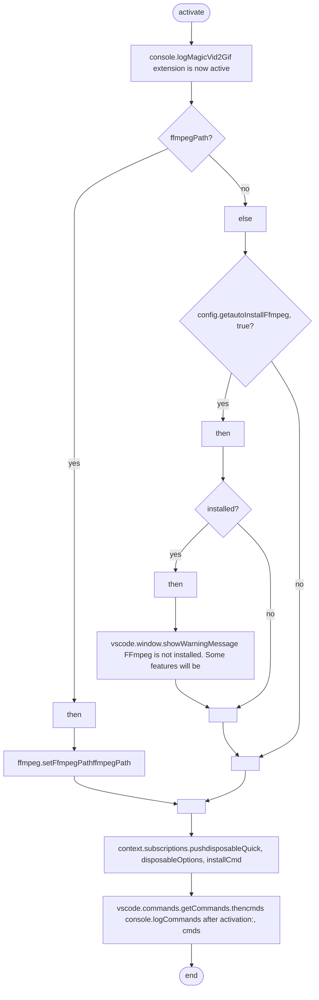

# extension
> src/extension.ts | Hub Score: 43/100

## Symbols
| Name | Type | Line |
|------|------|------|
| activate | function | 14 |
| showOptionsDialog | function | 149 |
| getVideoMetadataSafe | function | 188 |
| promptStartTime | function | 197 |
| promptDuration | function | 209 |
| promptResolution | function | 223 |
| promptFps | function | 250 |
| ResolvedProfile | type | 262 |
| ProfileChoice | type | 263 |
| promptOptimizationProfile | function | 265 |
| promptCustomOptimization | function | 287 |
| executeConversion | function | 315 |
| updateProgress | variable | 326 |
| progressCallback | variable | 359 |
| deactivate | function | 420 |

## Called by
| Symbol | File | Line |
|--------|------|------|
| activate | [src/extension.ts](src_extension.ts.md) | 97 |
| convert | [src/videoConverter.ts](src_videoConverter.ts.md) | 117 |
| activate | [src/extension.ts](src_extension.ts.md) | 127 |
| showOptionsDialog | [src/extension.ts](src_extension.ts.md) | 150 |
| showOptionsDialog | [src/extension.ts](src_extension.ts.md) | 151 |
| showOptionsDialog | [src/extension.ts](src_extension.ts.md) | 154 |
| showOptionsDialog | [src/extension.ts](src_extension.ts.md) | 157 |
| showOptionsDialog | [src/extension.ts](src_extension.ts.md) | 160 |
| showOptionsDialog | [src/extension.ts](src_extension.ts.md) | 163 |
| showOptionsDialog | [src/extension.ts](src_extension.ts.md) | 166 |
| ResolvedProfile | [src/extension.ts](src_extension.ts.md) | 262 |
| ProfileChoice | [src/extension.ts](src_extension.ts.md) | 263 |
| promptOptimizationProfile | [src/extension.ts](src_extension.ts.md) | 265 |
| promptCustomOptimization | [src/extension.ts](src_extension.ts.md) | 287 |
| executeConversion | [src/extension.ts](src_extension.ts.md) | 337 |
| progressCallback | [src/extension.ts](src_extension.ts.md) | 363 |

## External calls
| Symbol | File | Line |
|--------|------|------|
| createUiPort | [src/platform/vscode/uiPort.ts](src_platform_vscode_uiPort.ts.md) | 17 |
| createSettingsPort | [src/platform/vscode/settingsPort.ts](src_platform_vscode_settingsPort.ts.md) | 18 |
| createWorkspacePort | [src/platform/vscode/workspacePort.ts](src_platform_vscode_workspacePort.ts.md) | 19 |
| VideoConverter | [src/videoConverter.ts](src_videoConverter.ts.md) | 46 |
| OptimizationService | [src/optimizationService.ts](src_optimizationService.ts.md) | 47 |
| ConversionOptions | [src/types.ts](src_types.ts.md) | 86 |
| executeConversion | [src/extension.ts](src_extension.ts.md) | 97 |
| showOptionsDialog | [src/extension.ts](src_extension.ts.md) | 127 |
| ConversionOptions | [src/types.ts](src_types.ts.md) | 149 |
| getVideoMetadataSafe | [src/extension.ts](src_extension.ts.md) | 150 |
| promptStartTime | [src/extension.ts](src_extension.ts.md) | 151 |
| promptDuration | [src/extension.ts](src_extension.ts.md) | 154 |
| promptResolution | [src/extension.ts](src_extension.ts.md) | 157 |
| promptFps | [src/extension.ts](src_extension.ts.md) | 160 |
| promptOptimizationProfile | [src/extension.ts](src_extension.ts.md) | 163 |
| promptCustomOptimization | [src/extension.ts](src_extension.ts.md) | 166 |
| VideoMetadata | [src/types.ts](src_types.ts.md) | 188 |
| VideoMetadata | [src/types.ts](src_types.ts.md) | 209 |
| VideoMetadata | [src/types.ts](src_types.ts.md) | 223 |
| VideoMetadata | [src/types.ts](src_types.ts.md) | 250 |

## External calls

## Called by

## Control flow: `activate()`

