# ffmpegManager
> src/ffmpegManager.ts | Hub Score: 100/100

## Symbols
| Name | Type | Line |
|------|------|------|
| FfmpegBinary | interface | 12 |
| FfmpegManager | class | 19 |
| constructor | method | 73 |
| getInstance | method | 79 |
| getFfmpegPath | method | 89 |
| installFfmpeg | method | 136 |
| resolveBinary | method | 173 |
| computePaths | method | 189 |
| existingBinaryExists | method | 200 |
| ensureDirectories | method | 204 |
| ensureFfmpeg | method | 216 |
| downloadWithProgress | method | 244 |
| downloadArchive | method | 296 |
| extractAndCleanup | method | 300 |
| makeExecutableAndVerify | method | 310 |
| installFfmpegDarwinArm | method | 325 |
| isCommandAvailable | method | 344 |
| resolveSystemFfmpeg | method | 353 |
| tryUseOrInstallBrew | method | 393 |
| promptInstallBrewOrFallback | method | 416 |
| installBrewAndFfmpeg | method | 426 |
| downloadOsxExpertsFallback | method | 446 |
| verifyOsxArchive | method | 466 |
| installOsxArchive | method | 484 |
| safeFetchOsxChecksum | method | 497 |
| fetchOsxExpertsChecksum | method | 505 |
| computeFileSha256 | method | 519 |
| extractArchive | method | 528 |
| getExecutableName | method | 560 |
| performInstallSteps | method | 564 |
| getVersion | method | 593 |

## Called by
| Symbol | File | Line |
|--------|------|------|
| VideoConverter | [src/videoConverter.ts](src_videoConverter.ts.md) | 10 |
| FfmpegBinary | [src/ffmpegManager.ts](src_ffmpegManager.ts.md) | 12 |
| constructor | [src/videoConverter.ts](src_videoConverter.ts.md) | 13 |
| FfmpegManager | [src/ffmpegManager.ts](src_ffmpegManager.ts.md) | 19 |
| FfmpegManager | [src/ffmpegManager.ts](src_ffmpegManager.ts.md) | 28 |
| getInstance | [src/ffmpegManager.ts](src_ffmpegManager.ts.md) | 79 |
| getInstance | [src/ffmpegManager.ts](src_ffmpegManager.ts.md) | 81 |
| getFfmpegPath | [src/ffmpegManager.ts](src_ffmpegManager.ts.md) | 98 |
| getFfmpegPath | [src/ffmpegManager.ts](src_ffmpegManager.ts.md) | 114 |
| installFfmpeg | [src/ffmpegManager.ts](src_ffmpegManager.ts.md) | 144 |
| installFfmpeg | [src/ffmpegManager.ts](src_ffmpegManager.ts.md) | 147 |
| installFfmpeg | [src/ffmpegManager.ts](src_ffmpegManager.ts.md) | 149 |
| installFfmpeg | [src/ffmpegManager.ts](src_ffmpegManager.ts.md) | 158 |
| resolveBinary | [src/ffmpegManager.ts](src_ffmpegManager.ts.md) | 173 |
| computePaths | [src/ffmpegManager.ts](src_ffmpegManager.ts.md) | 189 |
| ensureFfmpeg | [src/ffmpegManager.ts](src_ffmpegManager.ts.md) | 217 |
| ensureFfmpeg | [src/ffmpegManager.ts](src_ffmpegManager.ts.md) | 231 |
| downloadWithProgress | [src/ffmpegManager.ts](src_ffmpegManager.ts.md) | 259 |
| downloadArchive | [src/ffmpegManager.ts](src_ffmpegManager.ts.md) | 297 |
| extractAndCleanup | [src/ffmpegManager.ts](src_ffmpegManager.ts.md) | 302 |

## External calls
| Symbol | File | Line |
|--------|------|------|
| FfmpegBinary | [src/ffmpegManager.ts](src_ffmpegManager.ts.md) | 12 |
| FfmpegManager | [src/ffmpegManager.ts](src_ffmpegManager.ts.md) | 19 |
| UiPort | [src/types/ports.ts](src_types_ports.ts.md) | 21 |
| SettingsPort | [src/types/ports.ts](src_types_ports.ts.md) | 22 |
| WorkspacePort | [src/types/ports.ts](src_types_ports.ts.md) | 23 |
| FfmpegBinary | [src/ffmpegManager.ts](src_ffmpegManager.ts.md) | 28 |
| UiPort | [src/types/ports.ts](src_types_ports.ts.md) | 73 |
| SettingsPort | [src/types/ports.ts](src_types_ports.ts.md) | 73 |
| WorkspacePort | [src/types/ports.ts](src_types_ports.ts.md) | 73 |
| UiPort | [src/types/ports.ts](src_types_ports.ts.md) | 79 |
| SettingsPort | [src/types/ports.ts](src_types_ports.ts.md) | 79 |
| WorkspacePort | [src/types/ports.ts](src_types_ports.ts.md) | 79 |
| FfmpegManager | [src/ffmpegManager.ts](src_ffmpegManager.ts.md) | 79 |
| FfmpegManager | [src/ffmpegManager.ts](src_ffmpegManager.ts.md) | 81 |
| getExecutableName | [src/ffmpegManager.ts](src_ffmpegManager.ts.md) | 98 |
| resolveSystemFfmpeg | [src/ffmpegManager.ts](src_ffmpegManager.ts.md) | 114 |
| resolveBinary | [src/ffmpegManager.ts](src_ffmpegManager.ts.md) | 144 |
| computePaths | [src/ffmpegManager.ts](src_ffmpegManager.ts.md) | 147 |
| existingBinaryExists | [src/ffmpegManager.ts](src_ffmpegManager.ts.md) | 149 |
| performInstallSteps | [src/ffmpegManager.ts](src_ffmpegManager.ts.md) | 158 |

## External calls
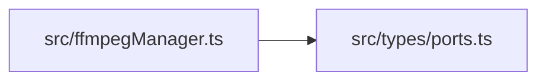

## Called by

## Control flow: `FfmpegManager.extractArchive()`
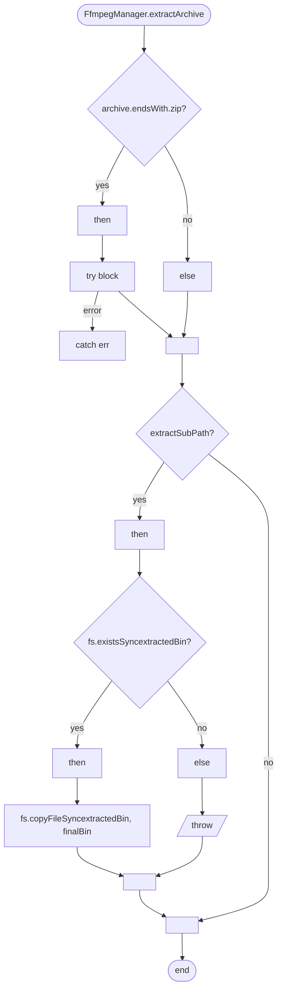

## Control flow: `FfmpegManager.resolveSystemFfmpeg()`
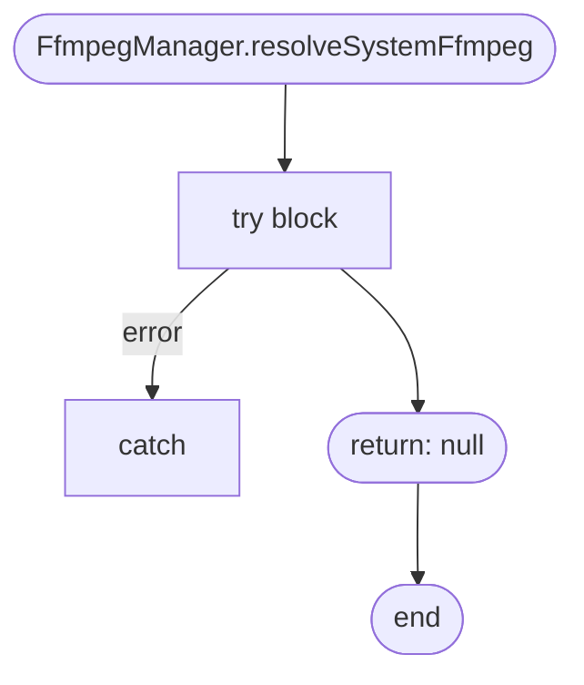

## Control flow: `FfmpegManager.getFfmpegPath()`
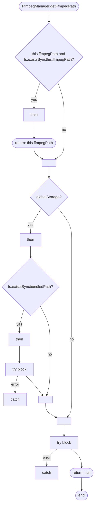

## Control flow: `FfmpegManager.installFfmpeg()`
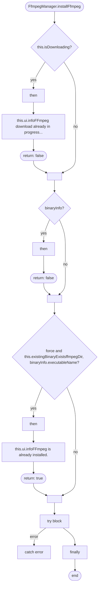

## Control flow: `FfmpegManager.installFfmpegDarwinArm()`
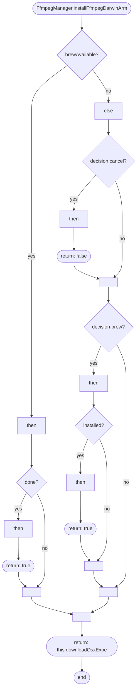

## Control flow: `FfmpegManager.ensureFfmpeg()`
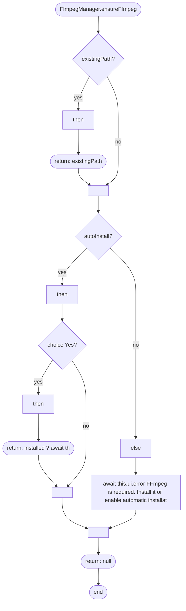

## Control flow: `FfmpegManager.downloadWithProgress()`
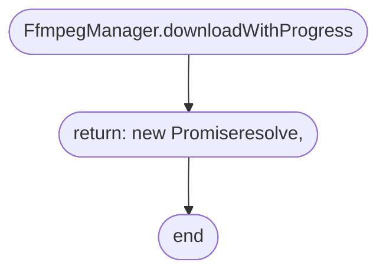

## Control flow: `FfmpegManager.verifyOsxArchive()`
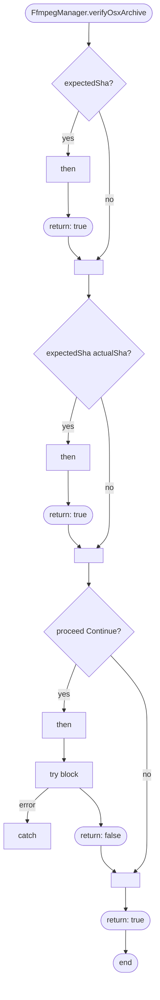

## Control flow: `FfmpegManager.resolveBinary()`
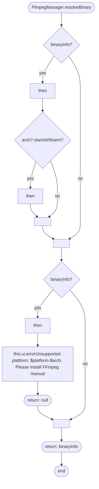

## Control flow: `FfmpegManager.tryUseOrInstallBrew()`
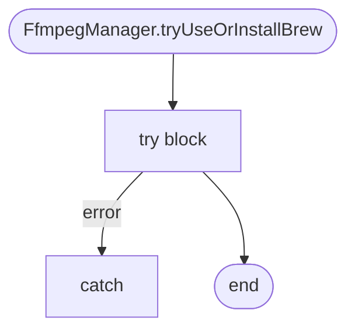

## Control flow: `FfmpegManager.getVersion()`
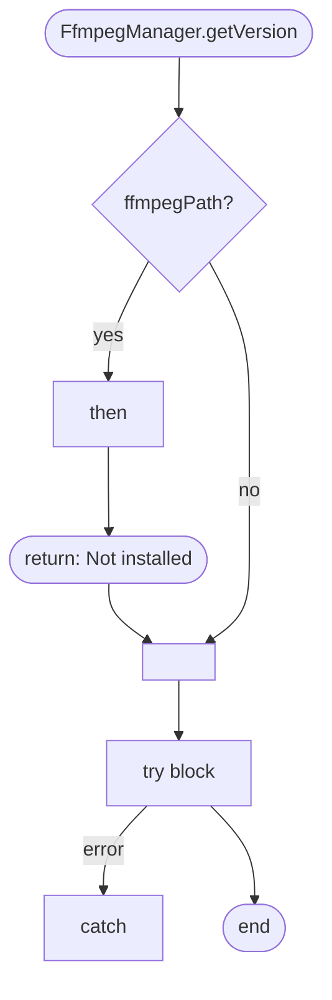

## Control flow: `FfmpegManager.ensureDirectories()`
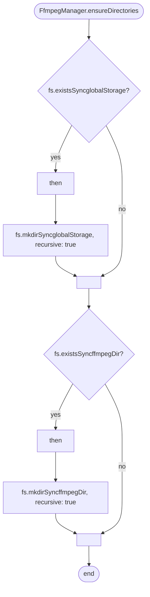

## Control flow: `FfmpegManager.promptInstallBrewOrFallback()`
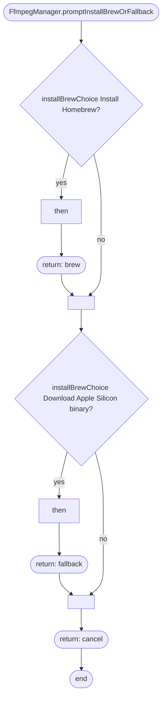

## Control flow: `FfmpegManager.installBrewAndFfmpeg()`
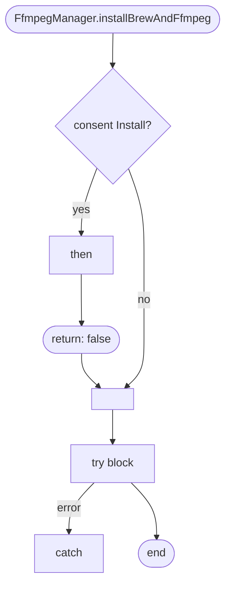

## Control flow: `FfmpegManager.downloadOsxExpertsFallback()`
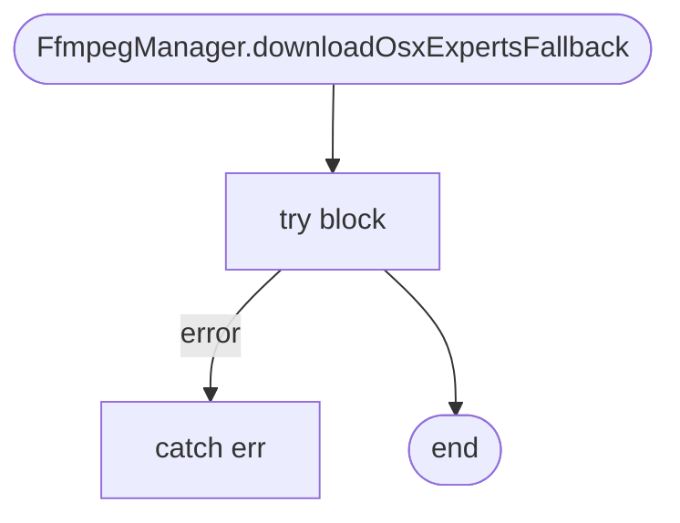

## Control flow: `FfmpegManager.installOsxArchive()`
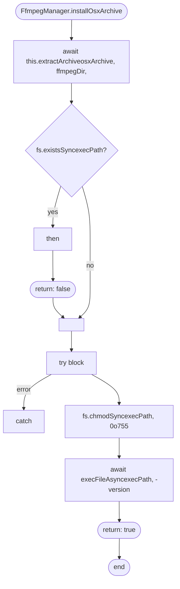

## Control flow: `FfmpegManager.fetchOsxExpertsChecksum()`
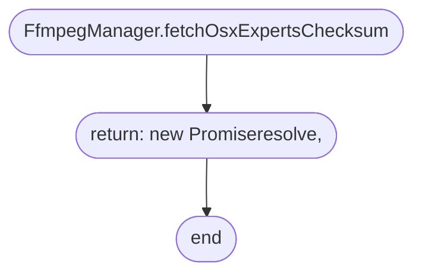

## Control flow: `FfmpegManager.performInstallSteps()`
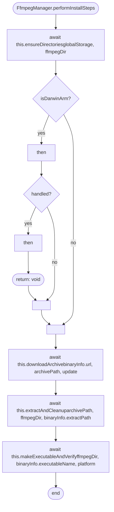
