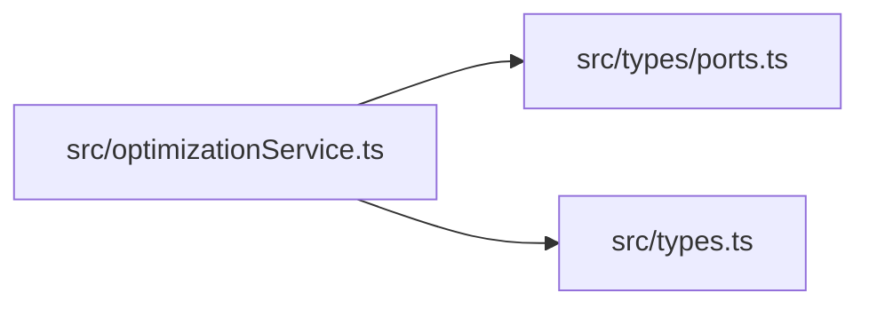
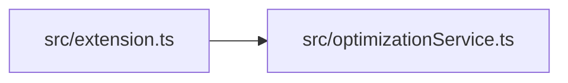
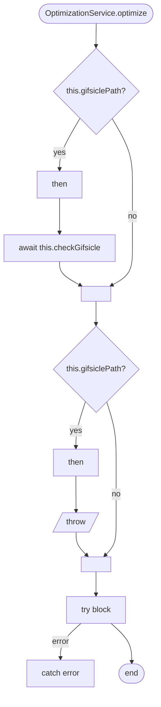
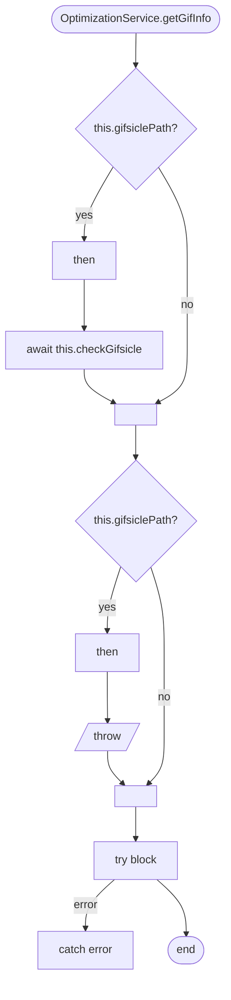
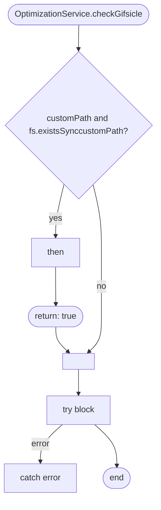

# optimizationService
> src/optimizationService.ts | Hub Score: 19/100

## Symbols
| Name | Type | Line |
|------|------|------|
| OptimizationService | class | 10 |
| constructor | method | 14 |
| checkGifsicle | method | 18 |
| optimize | method | 36 |
| getGifInfo | method | 71 |

## Called by
| Symbol | File | Line |
|--------|------|------|
| OptimizationService | [src/optimizationService.ts](src_optimizationService.ts.md) | 10 |
| optimize | [src/optimizationService.ts](src_optimizationService.ts.md) | 38 |
| activate | [src/extension.ts](src_extension.ts.md) | 47 |
| getGifInfo | [src/optimizationService.ts](src_optimizationService.ts.md) | 73 |

## External calls
| Symbol | File | Line |
|--------|------|------|
| OptimizationService | [src/optimizationService.ts](src_optimizationService.ts.md) | 10 |
| SettingsPort | [src/types/ports.ts](src_types_ports.ts.md) | 11 |
| SettingsPort | [src/types/ports.ts](src_types_ports.ts.md) | 14 |
| ConversionOptions | [src/types.ts](src_types.ts.md) | 36 |
| checkGifsicle | [src/optimizationService.ts](src_optimizationService.ts.md) | 38 |
| checkGifsicle | [src/optimizationService.ts](src_optimizationService.ts.md) | 73 |

## External calls

## Called by

## Control flow: `OptimizationService.optimize()`

## Control flow: `OptimizationService.getGifInfo()`

## Control flow: `OptimizationService.checkGifsicle()`

