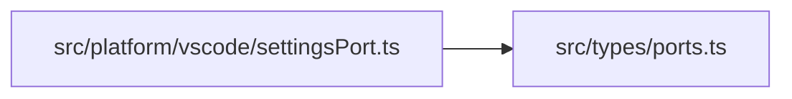
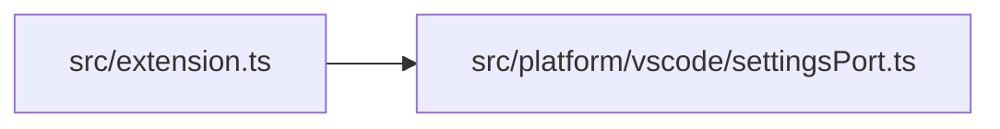

# settingsPort
> src/platform/vscode/settingsPort.ts | Hub Score: 19/100

## Symbols
| Name | Type | Line |
|------|------|------|
| VsCodeSettingsPort | class | 3 |
| constructor | method | 6 |
| get | method | 10 |
| createSettingsPort | function | 16 |

## Called by
| Symbol | File | Line |
|--------|------|------|
| VsCodeSettingsPort | [src/platform/vscode/settingsPort.ts](src_platform_vscode_settingsPort.ts.md) | 3 |
| get | [src/platform/vscode/settingsPort.ts](src_platform_vscode_settingsPort.ts.md) | 12 |
| createSettingsPort | [src/platform/vscode/settingsPort.ts](src_platform_vscode_settingsPort.ts.md) | 17 |
| activate | [src/extension.ts](src_extension.ts.md) | 18 |

## External calls
| Symbol | File | Line |
|--------|------|------|
| VsCodeSettingsPort | [src/platform/vscode/settingsPort.ts](src_platform_vscode_settingsPort.ts.md) | 3 |
| SettingsPort | [src/types/ports.ts](src_types_ports.ts.md) | 3 |
| get | [src/platform/vscode/settingsPort.ts](src_platform_vscode_settingsPort.ts.md) | 12 |
| SettingsPort | [src/types/ports.ts](src_types_ports.ts.md) | 16 |
| VsCodeSettingsPort | [src/platform/vscode/settingsPort.ts](src_platform_vscode_settingsPort.ts.md) | 17 |

## External calls

## Called by

