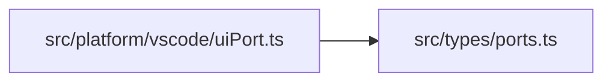
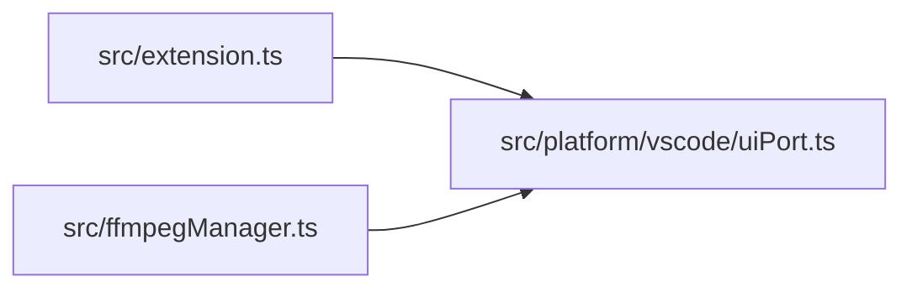

# uiPort
> src/platform/vscode/uiPort.ts | Hub Score: 38/100

## Symbols
| Name | Type | Line |
|------|------|------|
| VsCodeUiPort | class | 3 |
| pick | method | 4 |
| input | method | 14 |
| info | method | 23 |
| warn | method | 27 |
| error | method | 31 |
| withProgress | method | 35 |
| update | variable | 40 |
| createUiPort | function | 52 |

## Called by
| Symbol | File | Line |
|--------|------|------|
| VsCodeUiPort | [src/platform/vscode/uiPort.ts](src_platform_vscode_uiPort.ts.md) | 3 |
| activate | [src/extension.ts](src_extension.ts.md) | 17 |
| withProgress | [src/platform/vscode/uiPort.ts](src_platform_vscode_uiPort.ts.md) | 36 |
| createUiPort | [src/platform/vscode/uiPort.ts](src_platform_vscode_uiPort.ts.md) | 53 |
| downloadWithProgress | [src/ffmpegManager.ts](src_ffmpegManager.ts.md) | 279 |
| tryUseOrInstallBrew | [src/ffmpegManager.ts](src_ffmpegManager.ts.md) | 402 |
| installBrewAndFfmpeg | [src/ffmpegManager.ts](src_ffmpegManager.ts.md) | 434 |
| downloadOsxExpertsFallback | [src/ffmpegManager.ts](src_ffmpegManager.ts.md) | 451 |

## External calls
| Symbol | File | Line |
|--------|------|------|
| VsCodeUiPort | [src/platform/vscode/uiPort.ts](src_platform_vscode_uiPort.ts.md) | 3 |
| UiPort | [src/types/ports.ts](src_types_ports.ts.md) | 3 |
| withProgress | [src/platform/vscode/uiPort.ts](src_platform_vscode_uiPort.ts.md) | 36 |
| UiPort | [src/types/ports.ts](src_types_ports.ts.md) | 52 |
| VsCodeUiPort | [src/platform/vscode/uiPort.ts](src_platform_vscode_uiPort.ts.md) | 53 |

## External calls

## Called by

