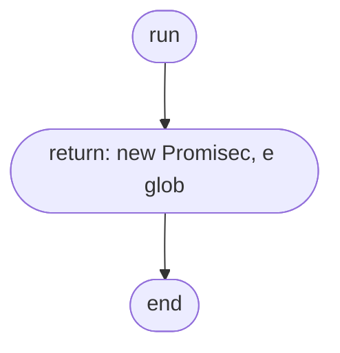

# index
> src/test/suite/index.ts | Hub Score: 5/100

## Symbols
| Name | Type | Line |
|------|------|------|
| run | function | 4 |

## Called by
| Symbol | File | Line |
|--------|------|------|
| run | [src/test/suite/index.ts](src_test_suite_index.ts.md) | 24 |

## External calls
| Symbol | File | Line |
|--------|------|------|
| run | [src/test/suite/index.ts](src_test_suite_index.ts.md) | 24 |

## Control flow: `run()`

