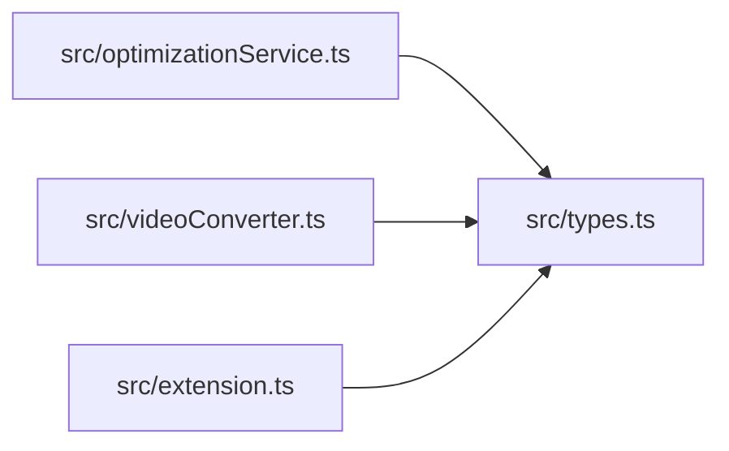

# types
> src/types.ts | Hub Score: 76/100

## Symbols
| Name | Type | Line |
|------|------|------|
| ConversionOptions | interface | 4 |
| VideoMetadata | interface | 15 |
| FfmpegProgress | interface | 22 |
| ConversionResult | interface | 31 |
| ProgressCallback | type | 38 |

## Called by
| Symbol | File | Line |
|--------|------|------|
| ConversionOptions | [src/types.ts](src_types.ts.md) | 4 |
| VideoMetadata | [src/types.ts](src_types.ts.md) | 15 |
| FfmpegProgress | [src/types.ts](src_types.ts.md) | 22 |
| ConversionResult | [src/types.ts](src_types.ts.md) | 31 |
| optimize | [src/optimizationService.ts](src_optimizationService.ts.md) | 36 |
| ProgressCallback | [src/types.ts](src_types.ts.md) | 38 |
| getVideoInfo | [src/videoConverter.ts](src_videoConverter.ts.md) | 39 |
| convert | [src/videoConverter.ts](src_videoConverter.ts.md) | 80 |
| convert | [src/videoConverter.ts](src_videoConverter.ts.md) | 81 |
| activate | [src/extension.ts](src_extension.ts.md) | 86 |
| convert | [src/videoConverter.ts](src_videoConverter.ts.md) | 113 |
| buildFilterComplex | [src/videoConverter.ts](src_videoConverter.ts.md) | 142 |
| showOptionsDialog | [src/extension.ts](src_extension.ts.md) | 149 |
| getVideoMetadataSafe | [src/extension.ts](src_extension.ts.md) | 188 |
| promptDuration | [src/extension.ts](src_extension.ts.md) | 209 |
| promptResolution | [src/extension.ts](src_extension.ts.md) | 223 |
| promptFps | [src/extension.ts](src_extension.ts.md) | 250 |
| executeConversion | [src/extension.ts](src_extension.ts.md) | 315 |

## External calls
| Symbol | File | Line |
|--------|------|------|
| ConversionOptions | [src/types.ts](src_types.ts.md) | 4 |
| VideoMetadata | [src/types.ts](src_types.ts.md) | 15 |
| FfmpegProgress | [src/types.ts](src_types.ts.md) | 22 |
| ConversionResult | [src/types.ts](src_types.ts.md) | 31 |
| ProgressCallback | [src/types.ts](src_types.ts.md) | 38 |

## Called by

