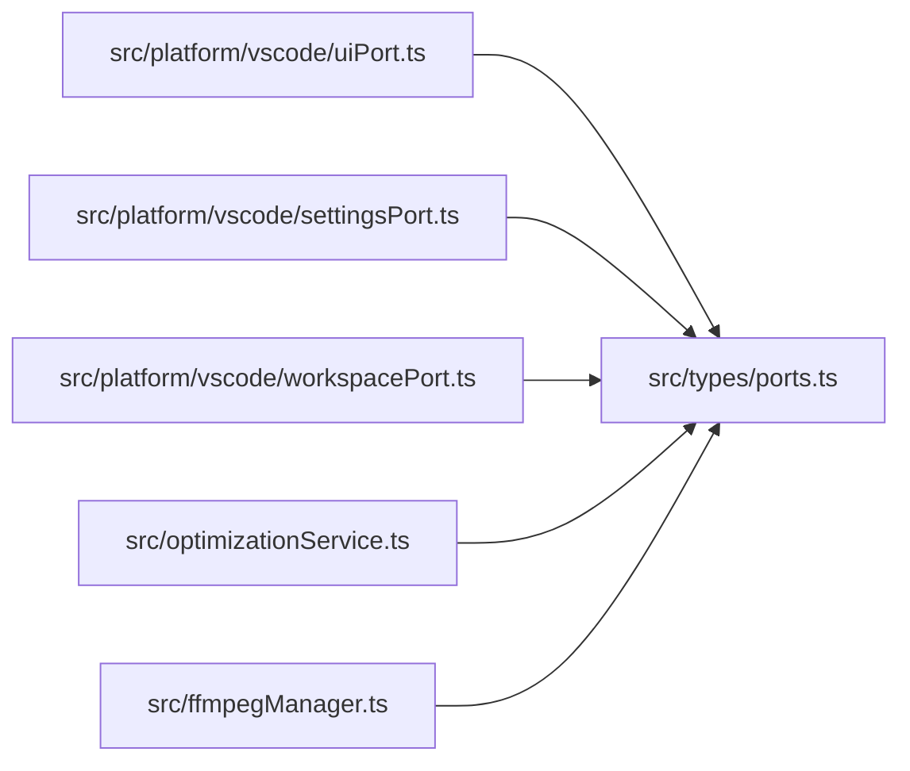

# ports
> src/types/ports.ts | Hub Score: 67/100

## Symbols
| Name | Type | Line |
|------|------|------|
| UiPort | interface | 2 |
| SettingsPort | interface | 11 |
| WorkspacePort | interface | 15 |

## Called by
| Symbol | File | Line |
|--------|------|------|
| UiPort | [src/types/ports.ts](src_types_ports.ts.md) | 2 |
| VsCodeUiPort | [src/platform/vscode/uiPort.ts](src_platform_vscode_uiPort.ts.md) | 3 |
| VsCodeSettingsPort | [src/platform/vscode/settingsPort.ts](src_platform_vscode_settingsPort.ts.md) | 3 |
| VsCodeWorkspacePort | [src/platform/vscode/workspacePort.ts](src_platform_vscode_workspacePort.ts.md) | 4 |
| OptimizationService | [src/optimizationService.ts](src_optimizationService.ts.md) | 11 |
| SettingsPort | [src/types/ports.ts](src_types_ports.ts.md) | 11 |
| constructor | [src/optimizationService.ts](src_optimizationService.ts.md) | 14 |
| WorkspacePort | [src/types/ports.ts](src_types_ports.ts.md) | 15 |
| createSettingsPort | [src/platform/vscode/settingsPort.ts](src_platform_vscode_settingsPort.ts.md) | 16 |
| FfmpegManager | [src/ffmpegManager.ts](src_ffmpegManager.ts.md) | 21 |
| FfmpegManager | [src/ffmpegManager.ts](src_ffmpegManager.ts.md) | 22 |
| FfmpegManager | [src/ffmpegManager.ts](src_ffmpegManager.ts.md) | 23 |
| createWorkspacePort | [src/platform/vscode/workspacePort.ts](src_platform_vscode_workspacePort.ts.md) | 24 |
| createUiPort | [src/platform/vscode/uiPort.ts](src_platform_vscode_uiPort.ts.md) | 52 |
| constructor | [src/ffmpegManager.ts](src_ffmpegManager.ts.md) | 73 |
| getInstance | [src/ffmpegManager.ts](src_ffmpegManager.ts.md) | 79 |

## External calls
| Symbol | File | Line |
|--------|------|------|
| UiPort | [src/types/ports.ts](src_types_ports.ts.md) | 2 |
| SettingsPort | [src/types/ports.ts](src_types_ports.ts.md) | 11 |
| WorkspacePort | [src/types/ports.ts](src_types_ports.ts.md) | 15 |

## Called by

