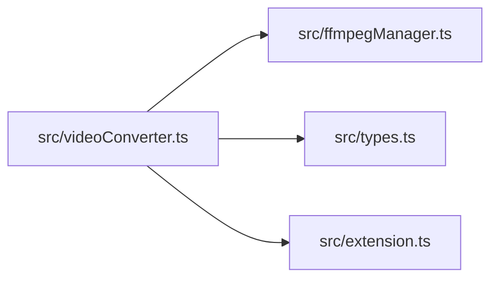
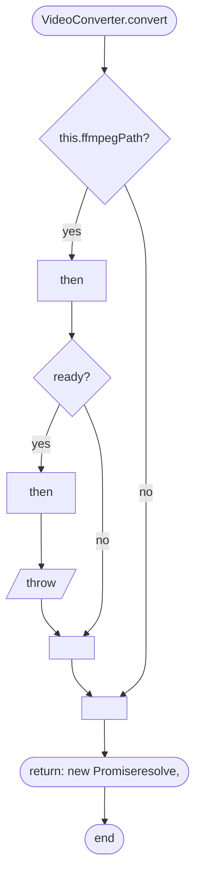
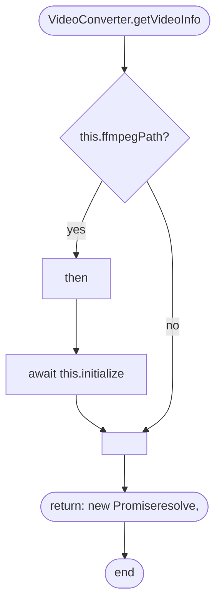
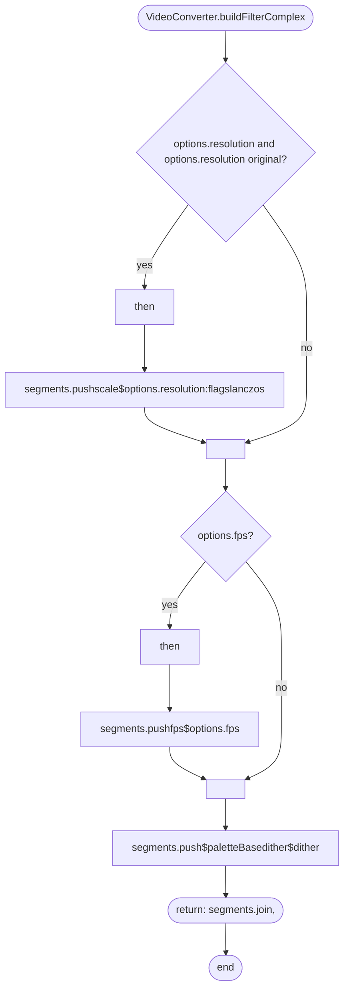

# videoConverter
> src/videoConverter.ts | Hub Score: 24/100

## Symbols
| Name | Type | Line |
|------|------|------|
| VideoConverter | class | 8 |
| constructor | method | 13 |
| initialize | method | 20 |
| checkFfmpeg | method | 29 |
| getVideoInfo | method | 39 |
| convert | method | 77 |
| getOptimizationFlags | method | 135 |
| buildFilterComplex | method | 142 |
| cancel | method | 161 |
| destroy | method | 167 |
| getFfmpegVersion | method | 171 |

## Called by
| Symbol | File | Line |
|--------|------|------|
| VideoConverter | [src/videoConverter.ts](src_videoConverter.ts.md) | 8 |
| getVideoInfo | [src/videoConverter.ts](src_videoConverter.ts.md) | 42 |
| activate | [src/extension.ts](src_extension.ts.md) | 46 |
| convert | [src/videoConverter.ts](src_videoConverter.ts.md) | 85 |
| convert | [src/videoConverter.ts](src_videoConverter.ts.md) | 94 |
| convert | [src/videoConverter.ts](src_videoConverter.ts.md) | 97 |
| destroy | [src/videoConverter.ts](src_videoConverter.ts.md) | 168 |

## External calls
| Symbol | File | Line |
|--------|------|------|
| VideoConverter | [src/videoConverter.ts](src_videoConverter.ts.md) | 8 |
| FfmpegManager | [src/ffmpegManager.ts](src_ffmpegManager.ts.md) | 10 |
| FfmpegManager | [src/ffmpegManager.ts](src_ffmpegManager.ts.md) | 13 |
| VideoMetadata | [src/types.ts](src_types.ts.md) | 39 |
| initialize | [src/videoConverter.ts](src_videoConverter.ts.md) | 42 |
| ConversionOptions | [src/types.ts](src_types.ts.md) | 80 |
| ProgressCallback | [src/types.ts](src_types.ts.md) | 81 |
| initialize | [src/videoConverter.ts](src_videoConverter.ts.md) | 85 |
| buildFilterComplex | [src/videoConverter.ts](src_videoConverter.ts.md) | 94 |
| getOptimizationFlags | [src/videoConverter.ts](src_videoConverter.ts.md) | 97 |
| FfmpegProgress | [src/types.ts](src_types.ts.md) | 113 |
| progressCallback | [src/extension.ts](src_extension.ts.md) | 117 |
| ConversionOptions | [src/types.ts](src_types.ts.md) | 142 |
| cancel | [src/videoConverter.ts](src_videoConverter.ts.md) | 168 |

## External calls

## Called by

## Control flow: `VideoConverter.convert()`

## Control flow: `VideoConverter.getVideoInfo()`

## Control flow: `VideoConverter.buildFilterComplex()`

