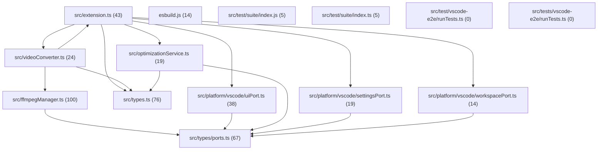

# Wiki — magicvid2gif

> ℹ️ 14 files included — auto-excludes: tests/, dist/, *.test.ts applied · 2 files excluded

## Architecture overview

## God Node
[ffmpegManager](articles/src_ffmpegManager.ts.md) — Hub Score: 100/100 — 31 symbols — 20 callers

## src/
| File | Hub Score | Symbols | Callers | Diagrams |
|------|-----------|---------|---------|----------|
| [ffmpegManager](articles/src_ffmpegManager.ts.md) | 100 | 31 | 20 | 20 |
| [types](articles/src_types.ts.md) | 76 | 5 | 18 | 1 |
| [extension](articles/src_extension.ts.md) | 43 | 15 | 16 | 3 |
| [videoConverter](articles/src_videoConverter.ts.md) | 24 | 11 | 7 | 5 |
| [optimizationService](articles/src_optimizationService.ts.md) | 19 | 5 | 4 | 5 |

## src/types/
| File | Hub Score | Symbols | Callers | Diagrams |
|------|-----------|---------|---------|----------|
| [ports](articles/src_types_ports.ts.md) | 67 | 3 | 16 | 1 |

## src/platform/vscode/
| File | Hub Score | Symbols | Callers | Diagrams |
|------|-----------|---------|---------|----------|
| [uiPort](articles/src_platform_vscode_uiPort.ts.md) | 38 | 9 | 8 | 2 |
| [settingsPort](articles/src_platform_vscode_settingsPort.ts.md) | 19 | 4 | 4 | 2 |
| [workspacePort](articles/src_platform_vscode_workspacePort.ts.md) | 14 | 6 | 3 | 2 |

## ./
| File | Hub Score | Symbols | Callers | Diagrams |
|------|-----------|---------|---------|----------|
| [esbuild](articles/esbuild.js.md) | 14 | 5 | 4 | 0 |

## src/test/suite/
| File | Hub Score | Symbols | Callers | Diagrams |
|------|-----------|---------|---------|----------|
| [index](articles/src_test_suite_index.js.md) | 5 | 1 | 1 | 0 |
| [index](articles/src_test_suite_index.ts.md) | 5 | 1 | 1 | 1 |

## src/test/vscode-e2e/
| File | Hub Score | Symbols | Callers | Diagrams |
|------|-----------|---------|---------|----------|
| [runTests](articles/src_test_vscode-e2e_runTests.ts.md) | 0 | 1 | 0 | 0 |

## src/tests/vscode-e2e/
| File | Hub Score | Symbols | Callers | Diagrams |
|------|-----------|---------|---------|----------|
| [runTests](articles/src_tests_vscode-e2e_runTests.ts.md) | 0 | 1 | 0 | 0 |
